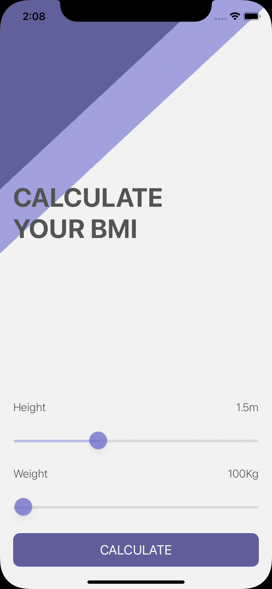
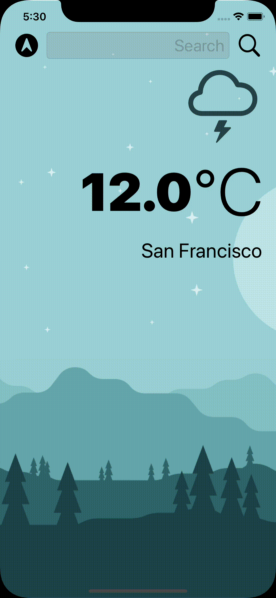

  

## Hi there, I'm Pedro Freitas 

 

<!--  -->

 

#### Principal Skills 🔧  

  &nbsp;&nbsp;&nbsp;
  &nbsp;&nbsp;&nbsp;
  &nbsp;&nbsp;&nbsp;
  &nbsp;&nbsp;&nbsp;
  &nbsp;&nbsp;&nbsp;
  &nbsp;&nbsp;&nbsp;
<!--   &nbsp;&nbsp;&nbsp; -->
  &nbsp;&nbsp;&nbsp;
  &nbsp;&nbsp;&nbsp;
  &nbsp;&nbsp;&nbsp;
<!--   &nbsp;&nbsp;&nbsp; -->
  &nbsp;&nbsp;&nbsp;
  &nbsp;&nbsp;&nbsp;
<!--   &nbsp;&nbsp;&nbsp; -->
<!--   &nbsp;&nbsp;&nbsp; -->

 

#### My GitHub Stats 📈 

  

 

#### This Week I Spent My Time On 📊

 

#### Highlights 💫

<table>
  <tr>
    <td align="center"></td>
    <td align="center"></td>
    <td align="center"></td>
  </tr>
</table>

